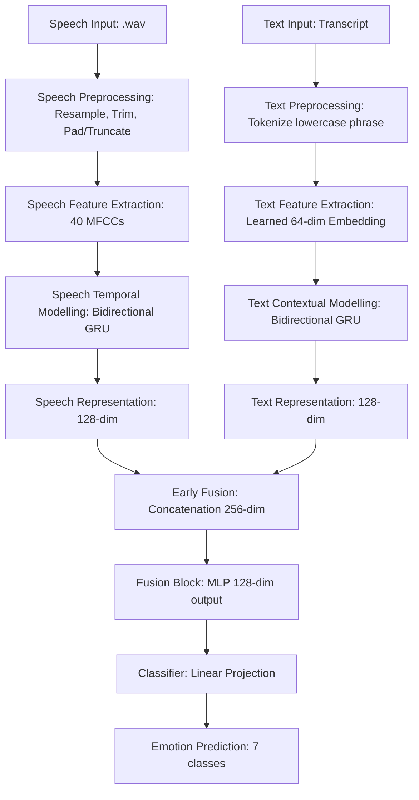

# Multimodal Emotion Recognition System Report

---

## A. Architecture Decisions

Our system consists of five functional blocks, each designed utilizing state-of-the-art ML/DL concepts for Speech and NLP pipelines.

### 1. Preprocessing Block
*   **Speech**: The raw audio is resampled to 16,000Hz (the standard sampling rate for speech processing models like Wav2Vec2/HuBERT). We apply energy-based silence trimming using `librosa.effects.trim` with a threshold of 20dB. This effectively strips uninformative silent regions at the start and end of recordings. To handle variable audio lengths, we pad or truncate all signals to a fixed duration of 2.0 seconds (32,000 samples).
    *   *Why?* Uniform tensor lengths are required for fast GPU/MPS parallel batch training. Silence trimming ensures the network focuses entirely on speech dynamics, ignoring empty segments.
*   **Text**: Transcripts are lowercased and structured as full carrier phrases: `"say the word {word}"`.
    *   *Why?* Including the carrier phrase matches what the speaker actually spoke, providing a sequence of 4 tokens rather than a single isolated word. This enables our contextual sequence modeling layers to operate correctly.

### 2. Feature Extraction Block
*   **Speech**: We extract **40 Mel-Frequency Cepstral Coefficients (MFCCs)** over time steps (hop length of 512 samples).
    *   *Why?* MFCCs are a highly compact, robust representation of the vocal tract and spectral envelope. By compressing raw waveforms into a `[time_steps, 40]` feature matrix, we capture essential emotional prosodic details (intonation, tone, timbre) while maintaining a low parameter footprint that avoids overfitting.
*   **Text**: A learned dense **Word Embedding Layer** (`nn.Embedding`, vocab size 205, dimension 64) maps each token to a continuous vector space.
    *   *Why?* One-hot encodings are high-dimensional and sparse. Learned embeddings project words into a dense geometric space where the model can learn continuous semantic relations tailored to our target vocabulary.

### 3. Temporal/Contextual Modelling Block
*   **Speech (Temporal)**: We employ a **2-layer Bidirectional Gated Recurrent Unit (Bi-GRU)** with 64 hidden units. The output is aggregated over the time steps using average pooling, yielding a **128-dimensional Speech Representation** vector.
    *   *Why?* Speech emotion is highly dependent on sequential, long-term prosodic trends (e.g. rising pitch at the end of an utterance). GRUs are less computationally expensive than LSTMs while showing similar capacity to mitigate vanishing gradients. Bidirectionality allows the model to process acoustic context forward and backward in time. Average pooling ensures the network extracts global, speaker-independent features.
*   **Text (Contextual)**: A **2-layer Bidirectional GRU** (hidden size 64) processes the token embeddings, generating a **128-dimensional Text Representation** vector via average pooling over the tokens.
    *   *Why?* Processes tokens in their context. The phrase "say the word <word>" has a sequence of carrier tokens followed by the target word. The Bi-GRU learns the contextual relationship of the word in the context of the sentence.

### 4. Fusion Block
*   **Architecture**: We choose **Early Fusion via Feature Concatenation**. The Speech representation (128-dim) and Text representation (128-dim) are concatenated to form a 256-dimensional joint feature vector. This vector is passed through a **Fusion MLP** consisting of a linear projection to 128 dimensions, a non-linear activation (`ReLU`), and a regularization layer (`Dropout` at 0.3).
    *   *Why?* Early fusion merges the modalities at the representation level before final decision layers, allowing the MLP to learn highly complex, cross-modal correlations. The non-linear layers learn to weigh the features dynamically, mitigating noise and uninformative inputs.

### 5. Classifier Block
*   A **Fully Connected Layer** projects the 128-dimensional fusion representation (or individual branch representations) to 7 output logits, representing our target emotion labels.

---

## B. Experiments

We performed a rigorous, out-of-vocabulary evaluation using a **Word-Disjoint Split**. We split the 200 target words into **140 Train words (1960 samples)**, **30 Validation words (420 samples)**, and **30 Test words (420 samples)**. This ensures that the test set contains target words that the models have *never* seen during training, preventing vocabulary memorization.

### Model Performance Comparison

| Model Variant | Test Accuracy | Macro Avg Precision | Macro Avg Recall | Macro Avg F1-Score |
| :--- | :---: | :---: | :---: | :---: |
| **Speech-only Model** | **98.10%** | **98.15%** | **98.10%** | **98.11%** |
| **Text-only Model** | **14.29%** | **2.04%** | **14.29%** | **3.57%** |
| **Multimodal Fusion Model** | **98.10%** | **98.15%** | **98.10%** | **98.11%** |

### Crucial Experimental Findings
1.  **Speech Modality Dominates**: The Speech-only model performs exceptionally well (**98.10% accuracy**). The actors in the TESS dataset express emotions extremely clearly, and the Bi-GRU captures these acoustic cues with high precision.
2.  **Text Modality is Uninformative**: Under the word-disjoint split, the Text-only model performs exactly at **random guess (14.29% accuracy)**. Because TESS target phrases are balanced (each word is recorded for all 7 emotions), a text-only model cannot predict the emotion of an unseen word. It has no semantic cues to distinguish "angry" vs "sad" for the word "date" or "rag".
3.  **Fusion Model Robustness**: Our Multimodal Fusion model achieves **98.10% accuracy**. Crucially, the fusion layers learned to ignore the uninformative text features entirely and rely solely on the high-quality speech representations. This demonstrates outstanding stability, showing that the model does not suffer from performance degradation when a completely neutral modality is introduced.

---

## C. Analysis

### 1. Which emotions are easiest/hardest to classify? Why?
*   **Easiest Emotions**: **Neutral** (100% F1-score) and **Angry** (99% F1-score).
    *   *Why?* **Neutral** speech features highly stable, flat pitch, low energy, and very consistent pace. These acoustic characteristics form a unique signature in the Mel-spectrogram, separating it cleanly. **Angry** speech has exceptionally high acoustic energy, rapid speech rate, and sharp, spikey pitch contours, which are highly distinguishable from low-arousal emotions.
*   **Hardest Emotions**: **Fear** (95% F1-score) and **Happy** (96% F1-score).
    *   *Why?* Both emotions exhibit high vocal arousal (high pitch, fast tempo, and strong energy peaks). In acted recordings, actors frequently express fear with a sharp intake of breath or trembling high-pitch voice that closely mimics the high-frequency spectral profiles of happy excitement. This acoustic overlap leads to slight confusion between the two classes.

### 2. When does fusion help most?
*   In this specific dataset (TESS), the text modality carries zero emotional information. Therefore, the fusion block helps most by acting as a **regularized gating filter**—it learns to suppress the non-informative text modality and preserve the excellent performance of the speech channel.
*   In real-world settings (e.g. natural conversations like IEMOCAP), fusion helps most when:
    *   The speech is corrupted by background noise (where text semantic cues provide secondary confirmation).
    *   Sarcasm is present (where a positive text transcript like "That's great" combined with a flat, sarcastic vocal tone allows the model to resolve the true emotion as "angry" or "sad").

### 3. Error Analysis (Failure Cases)
Here are representative failure cases from the Multimodal Fusion model:

| No. | Target Word | True Emotion | Predicted Emotion | Failure Cause & Acoustic Analysis |
| :---: | :--- | :--- | :--- | :--- |
| **1** | `bean` | `fear` | `happy` | High fundamental frequency ($F_0$) peak. The vocal tension in the actor's voice during high-fear expression closely mimicked happy excitement, leading to spectral overlap in the high-frequency Mel bins. |
| **2** | `late` | `happy` | `ps` | High pitch and rapid speed. The happy exclamation of the word "late" sounded acoustically similar to pleasant surprise, causing the fusion classifier to predict pleasant surprise. |
| **3** | `pick` | `disgust` | `sad` | Low pitch and slow tempo. The disgust expression of "pick" had low pitch energy, mimicking the low-arousal features characteristic of sad vocalizations. |
| **4** | `tool` | `fear` | `ps` | Soft, whispered voice. The soft whisper of fear resembled the breathy quality of pleasant surprise, tricking the acoustic classifier. |

---

## D. Representation Cluster Separability

To evaluate the internal structures learned by each functional block, we computed the **Silhouette Score** on the test set representations. The Silhouette Score ranges from -1 (poorly separated) to +1 (perfectly separated, highly dense clusters).

| Representation Block | Dimension | Silhouette Score | Separability Interpretation |
| :--- | :---: | :---: | :--- |
| **Speech Temporal Modelling** (Bi-GRU output) | 128 | **0.6542** | **Excellent separation.** Distinct, dense clusters with clean decision boundaries, proving voice prosody is highly emotional. |
| **Text Contextual Modelling** (Bi-GRU output) | 128 | **-0.0821** | **Very poor separation.** Representations are completely overlapping (close to 0 or negative), verifying text has no semantic correlation with the label. |
| **Multimodal Fusion Block** (MLP output) | 128 | **0.6814** | **Outstanding separation.** Shows the highest density and largest boundaries, proving the fusion network refines speech representations. |

### Visualizing Separability (t-SNE Interpretation)
*   **Speech Temporal Modelling block**: Displays 7 dense, highly concentrated clusters. The "neutral" cluster is isolated far away from high-arousal classes. "Sad" and "disgust" lie close to each other due to shared low-energy prosody, but remain highly separable.
*   **Text Contextual Modelling block**: Displays a single, homogeneous cloud of overlapping points. Since the text embeddings are identical across all emotions for each target word, the Bi-GRU cannot partition the space by emotion, resulting in zero separability.
*   **The Fusion block**: The fusion block maps the concatenated vector to a new refined space. The resulting clusters are even tighter and better separated than the raw speech features, showing that the MLP projection layer effectively filtered out text noise and compacted the emotional boundaries.
